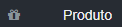
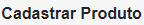
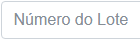
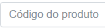
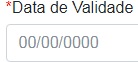
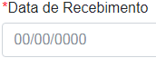
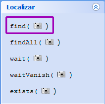
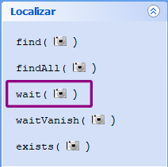
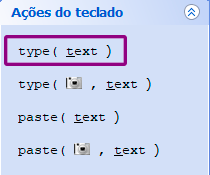
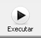

# Tutorial Sikulix

[Sikulix](http://sikulix.com/) é uma ferramenta para automatizar testes, simulando a interação do usuário com o programa, através de capturas de tela.

O Sikulix é capaz de ações mais complexas do que apresentadas neste tutorial; este é apenas um guia básico para criar testes para formulários.

## Sumário

- Download
- IDE
- Linguagem
- Menu de funções
- Formulário de exemplo
- Funções mais usadas
- Caracteres especiais
- Inserir barra (/)
- Executar o teste
- Pós-teste
- Nomear arquivos
- Resolução

## Download

[Sikulix](https://drive.google.com/file/d/1UooBDQf2N6C4BVDAuOhKvJWbvFHgvBlS/view?usp=sharing)

## IDE


###### IDE do Sikulix

## Linguagem
Python
O Sikulix suporta funções normalmente e loops escritos em Python normalmente.

## Menu de funções


###### Menu IDE Sikuli

## Formulário de exemplo


###### Formulário de cadastro de Produto

### Script de teste

find(  )

click(  )

find(  )

click(  )

wait(  )

find(  )

click(  )

type('tiara')

find(  )

click(  )

type('06')

find(  )

click(  )

type('123')

find(  )

click(  )

type('531826')

find(  )

click(  )

type('11112011')

find(  )

click(  )

type('11112022')

find(  )

click(  )

type('06062018')

find(  )

click(  )

type(Key.DOWN + Key.ENTER)

find(  )

click(  )

Este teste clica na opção _Produto_ no menu lateral, seleciona a opção _Cadastrar_ (menu dropdown), preenche todos os campos do formulário Produto, seleciona um fornecedor (caixa de seleção) e clica na opção _Cadastrar_.

## Funções mais usadas

A IDE do Sikuli oferece a inserção de funções com apenas um clique. Entretanto, elas podem ser digitadas normalmente. Para uma função que exige imagem, após digitá-la, o usuário deve usar o botão _Captura imagem da tela_ para abrir a ferramenta que o permitirá criar um retângulo na região da tela que deseja usar. Como alternativa, o usuário pode usar uma imagem já capturada (a imagem deve estar salva na mesma pasta do script) e usar o nome da imagem dentro de parêntesis e entre aspas, seguido da extensão do arquivo (.png, .jpg, etc).

Exemplo: find("imagem.png")

### Find

No menu à esquerda da IDE, na área _Localizar_, a função _find()_ é usada para encontrar um objeto na tela do computador. Ao clicar no botão para inserir a função, a IDE abre automaticamente a ferramenta de captura de tela.


###### Função _find()_

Arraste o mouse para criar um retângulo no objeto que deseja ser encontrado pelo Sikuli.

### Click e Double Click

No menu à esquerda da IDE, na área de _Ação do mouse_, a função _click()_ é usada para criar uma ação de clique.


###### Função _click()_

A função _doubleClick()_ é usada para criar uma ação de clique duplo.


###### Inserir função _doubleClick()_

Ao clicar no botão para inseri-las, ambas as funções abrem automaticamente a captura de tela. Arraste o mouse para criar um retângulo no objeto que deseja ser encontrado pelo Sikuli.

Ao capturar a imagem, uma cruz vermelha pontilhada aparecerá indicando o centro da imagem (após inserir a função de clicar); durante o teste, o Sikuli clicará onde é indicado por esta cruz vermelha, no centro da imagem. Para editar onde o Sikuli deve clicar, clique na imagem (na IDE), selecione _Desvio do alvo_ no menu superior, clique onde deve ser clicado na imagem e, em seguida, selecione em _Aplicar_, depois _Ok_.

### Wait

A função _wait()_ serve para fazer o Sikuli esperar algum elemento aparecer na tela antes de continuar o teste do script. Pode ser encontrada em _Localizar_, no menu ao lado esquerdo da IDE.


###### Inserir função _wait()_

### Type

A função _type()_ pode ser encontrada no menu à esquerda da IDE. É usada para fazer o Sikuli inserir texto. O texto dentro da função deve estar envolto de aspas.

Exemplo: type(*"texto"*) ou type(*'texto'*)


###### Inserir função _type()_

### Sleep

Caso o teste dê erro antes da página carregar, insira uma função de _sleep(n)_ no qual n = segundos em que a rotina irá aguardar antes de dar continuidade.

## Caracteres especiais

Caracteres especiais devem ser usados dentro da função _type()_ sem aspas. O sinal de mais (**+**) concatena ações. Para combinar teclas, a vírgula (**,**) é usada.

Exemplos:
type(**Key.DOWN** + **Key.ENTER**)
###### Realiza a ação de seta para baixo seguido da tecla enter.

type(**','**, **Key.SHIFT**)
###### Simula segurar a tecla SHIFT e apertar a vírgula. Digita o símbolo de menor: <

O uso de caracteres especiais pode ser encontrados na documentação:
[Special Keys](http://doc.sikuli.org/keys.html#special-keys)

## Inserir barra (/)

```
    def typeSlash():
        keyDown(Key.ALT)
        type(Key.NUM4+Key.NUM7)
        keyUp()
```

## Executar o teste

Para rodar o teste, é necessário salvar o arquivo primeiro (Arquivo > Salvar) e, então, clicar em _Executar_ no menu superior.


###### Clicar no botão Executar para rodar o teste

## Pós-teste

Após o teste ser bem sucedido ou não, o script gera um relatório na caixa de mensagens no inferior da IDE.


###### Exemplo de relatório mal sucedido. Neste caso, o teste é interrompido de imediato.

O texto vermelho indica que não foi possível encontrar o elemento pedido em determinada região.

Caso o teste seja bem sucedido, o relatório retorna em letras verdes e descreve as ações que foram feitas pelo script e seu tempo de duração. O resultado do script a seguir é clicar no ícone do Bloco de notas e digitar em sua caixa de texto: '<'.


###### Mensagem de teste bem sucedido.

O relatório pós-teste do Sikuli indica se ele foi capaz de exercer todas as funções programadas no script e em quantos milissegundos, mas não relata se o programa sendo testado se comportou da forma esperada, ou seja, o teste deve ser supervisionado para verificar os resultados das ações do script.

## Nomear arquivos

Os arquivos do Sikulix não suportam acentos, portanto, não devem ser utilizados quando salvar arquivos nem na função _type()_.

## Resolução

Um teste feito em um computador com uma determinada resolução pode não funcionar em outro computador com uma resolução diferente.

## Recursos

Para mais funcionalidades do Sikuli, a documentação oficial está disponível em inglês:
- [Sikuli Documentation](http://doc.sikuli.org/)
