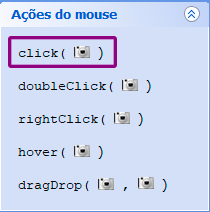
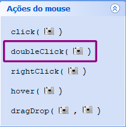

# Tutorial Sikulix

[Sikulix](http://sikulix.com/) é uma ferramenta para automatizar testes, simulando a interação do usuário com o programa, através de capturas de tela.

O Sikulix é capaz de ações mais complexas do que apresentadas neste tutorial; este é apenas um guia básico para criar testes para formulários.

## Sumário

- Download
- IDE
- Formulário de exemplo
- Teste
- Funções mais usadas
- Caracteres especiais
- Rodar o teste
- Nomear arquivos
- Resolução

## Download

[Sikulix](https://drive.google.com/file/d/1UooBDQf2N6C4BVDAuOhKvJWbvFHgvBlS/view?usp=sharing)

## IDE

###### IDE do Sikulix

## Formulário de exemplo

###### Formulário de cadastro de Produto

## Teste

###### Menu IDE Sikuli

### Script de teste

find 
click 

find 
click 

wait 

find 
click
type('tiara')

find 
click 
type('06')

find 
click 
type('123')

find 
click 
type('531826')

find 
click 
type('11112011')

find 
click 
type('11112022')

find 
click 
type('06062018')

find 
click 
type(Key.DOWN + Key.ENTER)

find 
click 

Este teste clica Em _Produto_ no menu, seleciona a opção _Cadastrar_, preenche todos os campos do formulário Produto, seleciona um fornecedor e clica na opção _Cadastrar_.

## Funções mais usadas

A IDE do Sikuli oferece a inserção de funções com apenas um clique. Entretanto, elas podem ser digitadas normalmente.

Para uma função que exige imagem, após digitá-la, o usuário deve usar o botão _Captura imagem da tela_ para abrir a ferramenta que o permitirá criar um retângulo na região que deseja usar. Como alternativa, o usuário pode usar uma imagem já capturada (a imagem deve estar salva na mesma pasta do script) e usar o nome da imagem dentro de parêntesis seguido da extensão do arquivo (.png, .jpg, etc).

Exemplo: find("imagem.png")

### Find

No menu à esquerda da IDE, na área de Localizar, a função _find()_ é usada para encontrar um objeto na tela do computador. Ao clicar no botão para inserir a função, a IDE abre automaticamente a ferramenta de captura de tela.

###### Função _find()_

Arraste o mouse para criar um retângulo no objeto que deseja ser encontrado pelo Sikuli.

### Click e Double Click

No menu à esquerda da IDE, na área de _Ação do mouse_, a função _click()_ é usada para criar uma ação de clique.

###### Função _click()_

A função _doubleClick()_ é usada para criar uma ação de clique duplo.

###### Inserir função _doubleClick()_

Ao clicar no botão para inseri-las, ambas as funções abrem automaticamente a captura de tela. Arraste o mouse para criar um retângulo no objeto que deseja ser encontrado pelo Sikuli.

Ao capturar a imagem, uma cruz vermelha aparecerá indicando o centro da imagem; durante o teste, o Sikuli clicará onde é indicado pelo centro desta cruz vermelha. Para editar onde o Sikuli deve clicar, clique na imagem, selecione _Desvio do alvo_ no menu superior, clique onde deve ser clicado na imagem e, em seguida, clique em _Aplicar_, depois _Ok_.

### Wait

A função _wait()_ serve para fazer o Sikuli esperar algum elemento aparecer na tela antes de continuar o teste do script. Pode ser encontrada em _Localizar_, no menu ao lado esquerdo da IDE.

Inserir função _wait()_

### Type

A função _type()_ pode ser encontrada no menu à esquerda da IDE. É usada para fazer o Sikuli inserir texto. O texto dentro da função deve estar envolto de aspas.

Exemplo: type(*"texto"*) ou type(*'texto'*)

###### Inserir função _type()_

## Caracteres especiais

Caracteres especiais devem ser usados dentro da função _type()_ sem aspas. O sinal de mais (*+*) concatena ações. Para combinar teclas, a vírgula (*,*) é usada.

Exemplos:
type(*Key.DOWN* + *Key.ENTER*)
###### Realiza a ação de seta para baixo seguido da tecla enter.

type(',', Key.SHIFT)
###### Simula segurar a tecla SHIFT e apertar a vírgula. Digita o símbolo de menor: <

O uso de caracteres especiais podem ser encontrados na documentação:
[Special Keys](http://doc.sikuli.org/keys.html#special-keys)

## Rodar o teste

Para rodar o teste, é necessário salvar o arquivo primeiro (Arquivo > Salvar) e, então, clicar em _Executar_ no menu superior.

######Clicar no botão Executar para rodar o teste

### Mensagens de alerta

Após o teste ser bem sucedido ou não, o script gera um relatório na caixa de mensagens no inferior da IDE.

###### Exemplo de relatório mal sucedido.
O texto vermelho indica que não foi possível encontrar o elemento pedido em determinada região.

Caso o teste seja bem sucedido, o relatório retorna em letras verdes e descreve as ações que foram feitas pelo script e seu tempo de duração. O resultado do script a seguir é clicar no ícone do Bloco de notas e digitar em sua caixa de texto: '<'.

###### Mensagem de teste bem sucedid.

## Nomear arquivos

Os arquivos do Sikulix não suportam acentos, portanto, não devem ser utilizados quando salvar arquivos.

## Resolução

Um teste feito em um computador com uma determinada resolução, pode não funcionar em outro computador com uma resolução diferente.

## Recursos

Para mais funcionalidades do Sikuli, a documentação oficial está disponível em inglês:
- [Sikuli Documentation](http://doc.sikuli.org/)
